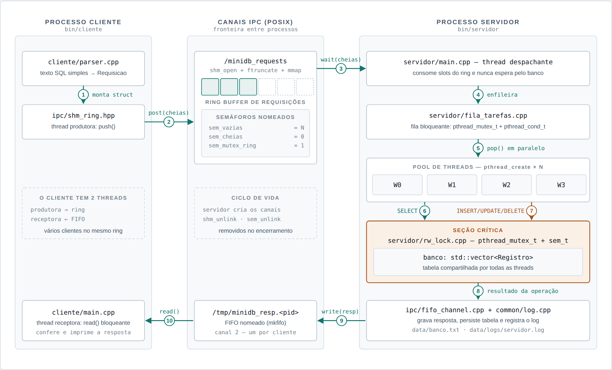
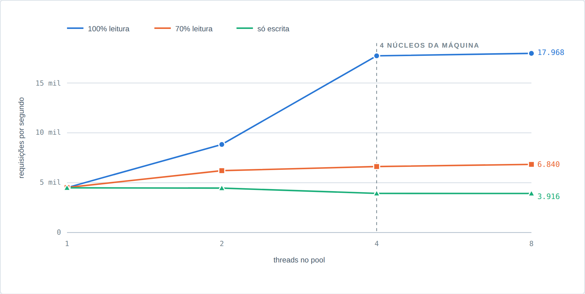

# minidb-ipc

Avaliação M1 — Sistemas Operacionais (Univali) — IPC, threads e paralelismo.

Simulador do núcleo de um gerenciador de requisições a banco de dados: um **processo cliente**
produz requisições em **memória compartilhada POSIX**, um **processo servidor** as consome com um
**pool de threads** e aplica cada operação sobre uma tabela protegida por um **lock de
leitores-escritores** (`pthread_mutex_t` + `sem_t`). As respostas voltam por um **FIFO nomeado** e
são registradas em log.

> **Status:** implementado, compilando sem warning e com os três testes passando.
> Falta o relatório em PDF e a apresentação.

## Documentação

| Arquivo | Conteúdo |
| --- | --- |
| [`docs/arquitetura.html`](docs/arquitetura.html) | Documento completo: fluxo ilustrado, resultados medidos, árvore de arquivos, contrato, conformidade com o enunciado e divisão do trio |
| [`docs/fluxo.svg`](docs/fluxo.svg) / `.png` | Figura 1 — fluxo do sistema |
| [`docs/leitores-escritores.svg`](docs/leitores-escritores.svg) / `.png` | Figura 2 — leitura concorrente vs. escrita exclusiva |
| [`docs/throughput.svg`](docs/throughput.svg) / `.png` | Figura 3 — throughput por número de threads |

## Como compilar e executar

Requer apenas `g++` com C++17 e um Linux com memória compartilhada POSIX e semáforos nomeados.

```bash
make                                    # compila bin/servidor e bin/cliente
make demo                               # ponta a ponta: servidor + cliente + log

# ou manualmente, em dois terminais
./bin/servidor --threads 4
./bin/cliente  --carga data/cargas/basica.txt

./scripts/multi_cliente.sh 4 500        # 4 clientes concorrentes, 500 requisições cada

make testes                             # compila os testes
./bin/test_ipc && ./bin/test_rw_lock && ./bin/test_corrida

./scripts/benchmark.sh                  # bateria de medições -> resultados/metricas.csv
python3 scripts/plot.py                 # gráficos do relatório
```

O servidor encerra com `Ctrl+C` ou `SIGTERM`: o sinal interrompe o `sem_wait` da thread despachante,
que fecha a fila, espera os workers drenarem o que sobrou, salva o banco e remove a memória
compartilhada, os semáforos e os FIFOs. Se algum processo for morto com `-9` e deixar objetos de
kernel para trás, `make limpar-ipc` resolve.

**Opções do servidor:** `--threads N` (padrão 4), `--slots N` (padrão 64),
`--custo-us N` (custo de processamento simulado por requisição, padrão 0),
`--banco arquivo`, `--silencioso`. Também aceita `MINIDB_THREADS`, `MINIDB_SLOTS` e
`MINIDB_CUSTO_US` no ambiente.

**Opções do cliente:** `--carga arquivo`, `--gerar N` (carga sintética),
`--leitura P` (% de SELECT, padrão 70), `--faixa N`, `--semente N`, `--silencioso`.

## Fluxo do sistema



1. O cliente lê a carga e o `parser` converte `SELECT nome WHERE id=5` em uma `Requisicao` de tamanho fixo.
2. A thread produtora faz `sem_wait(vazias)`, entra no `sem_mutex_ring`, copia a struct no slot e faz `sem_post(cheias)`.
3. A thread despachante do servidor faz `sem_wait(cheias)`, retira o slot e devolve espaço com `sem_post(vazias)`.
4. A requisição vai para a fila interna; a despachante volta imediatamente ao ring.
5. Os `N` workers do pool acordam na condvar e retiram tarefas em paralelo.
6. `SELECT` entra como leitor — vários workers leem a tabela ao mesmo tempo.
7. `INSERT`, `UPDATE` e `DELETE` entram como escritores — acesso exclusivo.
8. O worker monta a `Resposta` com status, dados e tempo de espera no lock.
9. A resposta é escrita no FIFO do cliente (um FIFO por pid, uma escrita por vez sob mutex) e replicada no log.
10. A thread receptora do cliente lê a resposta, confere contra a requisição e imprime.

## Conformidade com o enunciado

| Requisito obrigatório | Onde é atendido |
| --- | --- |
| Dois binários, processos de SO distintos | `src/servidor/main.cpp`, `src/cliente/main.cpp` |
| IPC real (não polling em arquivo) | `ipc/shm_ring.cpp` (requisições), `ipc/fifo_channel.cpp` (respostas) |
| Servidor com pool de threads | `servidor/pool_threads.cpp`, `servidor/fila_tarefas.cpp` |
| Tabela protegida por mutex/semáforo real | `servidor/rw_lock.cpp`, `servidor/banco.cpp` |
| INSERT, DELETE, SELECT, UPDATE por ID | `servidor/executor.cpp` |
| `struct Registro { int id; char nome[50]; }` | `common/registro.hpp` |
| Respostas em 2º canal IPC ou log | `ipc/fifo_channel.cpp` + `common/log.cpp` (os dois) |
| Resultados de simulação para o relatório | `scripts/benchmark.sh`, `servidor/metricas.cpp` |

## Resultados medidos

Máquina de 4 núcleos, 10.000 requisições por execução, mediana de 3 repetições,
custo de processamento simulado de 200&nbsp;µs por requisição (`--custo-us 200`).



| Threads | 100% leitura | espera no lock | 70% leitura | espera no lock | Só escrita | espera no lock |
| ---: | ---: | ---: | ---: | ---: | ---: | ---: |
| 1 | 4.505 req/s | 0,17 µs | 4.517 req/s | 0,15 µs | 4.489 req/s | 0,12 µs |
| 2 | 8.837 req/s | 0,17 µs | 6.210 req/s | 88 µs | 4.458 req/s | 208 µs |
| 4 | 17.721 req/s | 0,15 µs | 6.623 req/s | 354 µs | 3.928 req/s | 774 µs |
| 8 | 17.968 req/s | 0,13 µs | 6.840 req/s | 925 µs | 3.916 req/s | 1.799 µs |

- **Leitura escala quase linearmente** até o número de núcleos (1,00 → 1,96 → 3,93×) e depois
  estabiliza: os `SELECT` dividem o lock e correm de fato em paralelo.
- **Escrita não escala em ponto nenhum**, e a espera no lock cresce proporcionalmente ao número de
  threads: a seção crítica é exclusiva, então acrescentar workers só aumenta a fila na porta.
- **Sem custo simulado** (`--custo-us 0`) o resultado se inverte: 1 thread rende ~105.000 req/s e mais
  threads pioram para ~40.000. Com trabalho de poucos nanossegundos por requisição, sincronizar custa
  mais do que o paralelismo economiza — é a lei de Amdahl aparecendo na prática, não um defeito da
  implementação. Vale discutir isso no relatório.

E a demonstração da condição de corrida (`./bin/test_corrida`, 8 threads × 2.000 inserções):

```
SEM lock ... 7.869 registros  (REGISTROS PERDIDOS — condição de corrida)
COM lock ... 16.000 registros (correto)
```

## Estrutura de arquivos

```
minidb-ipc/
├── Makefile                       # gera bin/servidor e bin/cliente (-pthread -lrt)
├── README.md
├── .gitignore
│
├── include/
│   ├── common/                    # CONTRATO — travado antes de qualquer código
│   │   ├── registro.hpp           # struct Registro { int id; char nome[50]; }
│   │   ├── protocolo.hpp          # Op, Status, Requisicao, Resposta (POD, tam. fixo)
│   │   ├── config.hpp             # nomes de shm/FIFO/sem, N_SLOTS, N_THREADS
│   │   └── log.hpp                # log com timestamp e id da thread
│   ├── ipc/                       # CAMADA IPC — só objetos do kernel
│   │   ├── shm_region.hpp         # RAII: shm_open + ftruncate + mmap + unlink
│   │   ├── named_sem.hpp          # RAII: sem_open / sem_wait / sem_post / sem_unlink
│   │   ├── shm_ring.hpp           # ring buffer produtor-consumidor sobre a shm
│   │   └── fifo_channel.hpp       # RAII: mkfifo + open + read/write de Resposta
│   ├── servidor/                  # CONCORRÊNCIA — threads e exclusão mútua
│   │   ├── rw_lock.hpp            # leitores-escritores: pthread_mutex_t + sem_t
│   │   ├── banco.hpp              # tabela std::vector<Registro> guardada pelo rw_lock
│   │   ├── fila_tarefas.hpp       # fila bloqueante: mutex + pthread_cond_t
│   │   ├── pool_threads.hpp       # pthread_create / pthread_join dos N workers
│   │   ├── executor.hpp           # aplica INSERT / DELETE / SELECT / UPDATE
│   │   ├── persistencia.hpp       # carrega e salva data/banco.txt
│   │   └── metricas.hpp           # latência, throughput, espera no lock
│   └── cliente/
│       ├── parser.hpp             # "SELECT nome WHERE id=5" → Requisicao
│       └── gerador_carga.hpp      # carga de arquivo ou sintética (mix leitura/escrita)
│
├── src/                           # espelha include/, 1 .cpp por cabeçalho
│   ├── common/    protocolo.cpp · config.cpp · log.cpp
│   ├── ipc/       shm_region.cpp · named_sem.cpp · shm_ring.cpp · fifo_channel.cpp
│   ├── servidor/
│   │   ├── main.cpp               # BINÁRIO 1: cria canais, sobe o pool, despacha
│   │   └── rw_lock.cpp · banco.cpp · fila_tarefas.cpp · pool_threads.cpp
│   │       executor.cpp · persistencia.cpp · metricas.cpp
│   └── cliente/
│       ├── main.cpp               # BINÁRIO 2: thread produtora + thread receptora
│       └── parser.cpp · gerador_carga.cpp
│
├── data/
│   ├── banco.inicial.txt          # estado carregado na subida do servidor
│   ├── cargas/                    # basica.txt · so_leitura.txt · mista.txt · disputa_id.txt
│   └── logs/                      # servidor.log e cliente.log (gerados)
│
├── scripts/
│   ├── demo.sh                    # sobe o servidor, roda 1 cliente, mostra o log
│   ├── multi_cliente.sh           # vários clientes disputando o mesmo ring
│   ├── benchmark.sh               # varia N_THREADS (1,2,4,8) e o mix de operações
│   └── plot.py                    # gráficos do relatório a partir dos CSVs
│
├── tests/
│   ├── test_ipc.cpp               # ring cheio, ring vazio, cliente antes do servidor
│   ├── test_rw_lock.cpp           # N leitores juntos, escritor exclusivo, sem starvation
│   └── test_corrida.cpp           # mesma carga SEM lock: exibe a condição de corrida
│
├── resultados/                    # CSVs e gráficos citados no relatório
└── docs/
    ├── arquitetura.html           # documento de arquitetura
    ├── fluxo.svg / .png           # figura 1
    ├── leitores-escritores.svg / .png  # figura 2
    └── relatorio/                 # artigo em PDF (ABNT) + fontes
```

## Contrato entre os dois binários

Structs POD de tamanho fixo, sem ponteiros e sem `std::string`: um slot do ring e uma mensagem do
FIFO são cópias byte a byte, então o mesmo cabeçalho serve aos dois processos.

```cpp
// include/common/protocolo.hpp
enum class Op     : uint8_t { INSERT, DELETE, SELECT, UPDATE };
enum class Status : uint8_t { OK, NAO_ENCONTRADO, ID_DUPLICADO, TABELA_CHEIA, MALFORMADA };

struct Requisicao {   // cliente → servidor, via ring na memória compartilhada
    uint32_t id_req;      // correlaciona requisição e resposta
    int32_t  pid_cliente; // permite vários clientes no mesmo ring
    Op       op;
    int32_t  id;          // chave do registro
    char     nome[50];    // carga útil de INSERT / UPDATE
};

struct Resposta {     // servidor → cliente, via FIFO nomeado
    uint32_t id_req;
    Status   status;
    Registro registro;    // preenchido em SELECT
    uint64_t us_no_lock;  // tempo esperando o lock — alimenta as métricas
    uint32_t worker;      // qual thread do pool atendeu
};
```

## Divisão do trio

| Frente | Arquivos | Apresenta |
| --- | --- | --- |
| 1 — IPC | `ipc/*`, `tests/test_ipc.cpp` | `shm_open`, `mmap`, `sem_open`, `mkfifo` |
| 2 — Concorrência | `servidor/rw_lock`, `banco`, `fila_tarefas`, `pool_threads`, `executor` | seção crítica, condição de corrida, deadlock evitado |
| 3 — Cliente e medição | `cliente/*`, `metricas`, `scripts/` | resultados e escalabilidade por nº de threads |

O trio fecha junto `common/protocolo.hpp` e `common/config.hpp` antes de qualquer implementação.

## Sequência de implementação

1. `common/` + `Makefile`: dois binários que compilam e imprimem versão.
2. `ipc/`: cliente envia uma requisição, servidor imprime — sem banco ainda.
3. `banco` + `executor` com uma única thread: as quatro operações corretas.
4. `fila_tarefas` + `pool_threads`: N workers, ainda com mutex simples.
5. `rw_lock`: leitura compartilhada e escrita exclusiva no lugar do mutex único.
6. FIFO de respostas, log e persistência fechando o ciclo até o cliente.
7. `tests/` + `benchmark.sh`: medições, CSVs e gráficos do relatório.
8. Relatório em PDF (ABNT) e ensaio da apresentação com o repositório público.

## Limites conhecidos

- A busca na tabela é linear, O(n) por requisição — suficiente para a escala do trabalho, mas é o
  primeiro ponto a trocar por um índice se a tabela crescer.
- Requisições de um mesmo cliente são atendidas **em paralelo**, então não há ordem garantida entre
  elas. Um `INSERT` seguido de `SELECT` do mesmo id pode ser atendido fora de ordem por workers
  diferentes. Isso é consequência direta do paralelismo pedido no enunciado; garantir ordem exigiria
  particionar as requisições por id entre os workers.
- A tabela vive em memória durante a execução; o arquivo `data/banco.txt` é gravado no encerramento.
